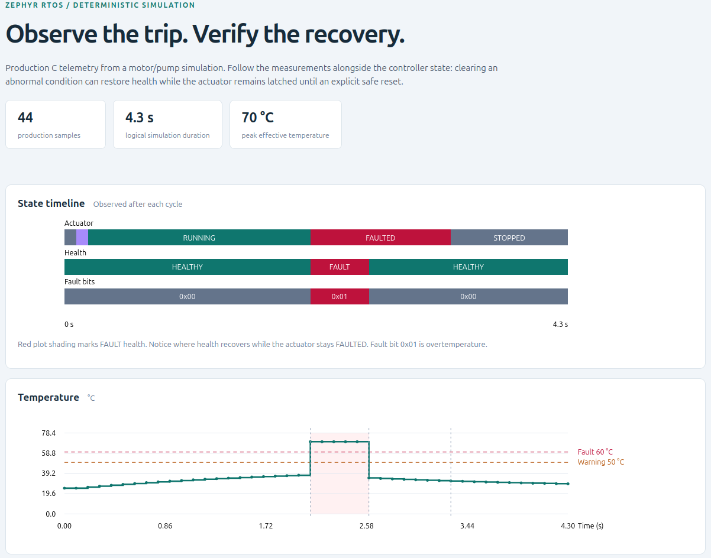
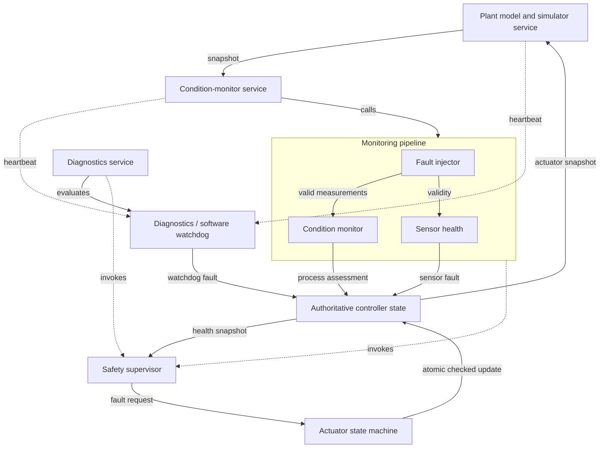

# Industrial RTOS Condition-Monitoring Controller

A simulation-only controller built in C on Zephyr RTOS for a virtual industrial motor/pump. It monitors temperature, vibration, and current, detects abnormal conditions, and applies conservative actuator safety behaviour. Deterministic fault injection and software-watchdog supervision make fault detection, shutdown, and explicit recovery repeatable and testable on `native_sim`.

## Highlights

- Three concurrent Zephyr services for plant simulation, monitoring, and diagnostics.
- Deterministic motor/pump model with independent process and sensor-failure injection.
- Mutex-protected controller state, explicit fault ownership, and atomic actuator updates.
- Latched FAULTED state with guarded reset and no automatic restart.
- Software heartbeat watchdog with deterministic timeout testing.
- C-generated telemetry, offline HTML/SVG visualization, and **115 automated tests**.

## Demo / Visualization

The deterministic demo starts the actuator, runs nominally, injects overtemperature, trips to FAULTED, clears the fault, and performs an explicit safe reset. The visualization shows temperature, vibration, current, warning/fault thresholds, actuator and health/fault timelines, and trip/recovery/reset events.

After the [Dev Container setup](#build-and-run), generate it from the repository root:

```sh
sh tools/generate_visualization.sh
```

Outputs are `build/visualization/scenario.csv` and `build/visualization/scenario.html`. Open the HTML locally in a browser. It is a self-contained, offline telemetry visualization of a recorded scenario, not a live dashboard.



Offline generated telemetry: RUNNING → overtemperature fault → FAULTED → measurement recovery → FAULTED latch → explicit safe reset → STOPPED. This is a recorded scenario, not a live dashboard. The complete generated HTML also contains the vibration/current plots and recorded-event table.

## Architecture



See [Architecture](docs/architecture.md) for module responsibilities, worker execution, the state machine, and fault/recovery flow.

## Safety Model

Condition monitoring owns the overtemperature, vibration, and overcurrent fault bits; sensor health owns `SENSOR_FAILURE`; diagnostics owns `SOFTWARE_WATCHDOG`. Each subsystem clears only its own bits, so recovering one condition preserves unrelated faults. Invalid samples retain the last process assessment and assert sensor failure.

On FAULT or EMERGENCY_STOP health, the safety supervisor requests FAULTED through the actuator state machine, including from STOPPED. Invalid transitions are rejected. FAULTED remains latched after measurements or heartbeats recover: an explicit reset returns it to STOPPED only when no fault bits remain and health is below FAULT. There is no automatic restart.

## RTOS Execution

| Worker | Sleep interval | Priority | Stack |
|---|---:|---:|---:|
| Plant simulator | 100 ms | 5 | 1024 B |
| Condition-monitor service | 100 ms | 4 | 1024 B |
| Diagnostics service | 100 ms | 3 | 1024 B |

Lower Zephyr priority numbers have higher preemptive priority in this configuration. Plant and monitor workers report heartbeats after successful cycles. Heartbeats become stale when their age exceeds **500 ms**; exactly 500 ms remains healthy.

Workers sleep after doing work, so cycle intervals include execution and scheduling time. No hard-real-time scheduling guarantee is demonstrated.

## Faults and Simulation Thresholds

| Measurement | WARNING at or above | FAULT at or above | Injected value |
|---|---:|---:|---:|
| Temperature | 50.000 °C | 60.000 °C | 70.000 °C |
| Vibration | 2.500 mm/s | 3.500 mm/s | 4.500 mm/s |
| Current | 5.500 A | 7.000 A | 8.000 A |

These are project simulation parameters, not universal industrial limits. Injection also supports explicit sensor-invalid status without a numeric sentinel. Missed service heartbeats set a separate software-watchdog fault. Injection flags can be combined and cleared through the programmatic API.

## Testing

**Verified result: 115 passed, 0 failed, 0 skipped.**

| Test application | Coverage | Tests |
|---|---|---:|
| `controller_state` | State, snapshots, checked actuator updates, reset guards | 13 |
| `plant_model` | Nominal behaviour, thermal response, semantic determinism | 8 |
| `monitoring_safety` | Condition monitor 22; actuator 16; supervisor 6; integration 3 | 47 |
| `batch2` | Fault injection 15; diagnostics 16; integration 8 | 39 |
| `scenarios` | Startup, run/stop, trips, ownership, recovery, deterministic replay | 8 |
| **Total** | | **115** |

Coverage includes unsigned measurement boundaries and stale actuator-update rejection. Scenario tests orchestrate production APIs with controlled plant/heartbeat timestamps rather than fragile timing sleeps or frozen worker threads.

## Project Structure

```text
.devcontainer/       Container definition and Zephyr workspace setup
include/             Production public APIs
src/                 Controller logic and runtime services
tests/               Unit, integration, and end-to-end applications
samples/telemetry/   Deterministic C telemetry application
tools/               Offline rendering and regeneration workflow
docs/                Detailed architecture
CMakeLists.txt       Normal application sources
prj.conf             Normal application configuration
```

## Build and Run

Use Docker, VS Code, and the Dev Containers extension. Clone this repository and open its folder in VS Code:

```sh
git clone https://github.com/akaShinigami/industrial-rtos-condition-monitor.git
cd industrial-rtos-condition-monitor
```

Select **Dev Containers: Reopen in Container**. The container uses `ghcr.io/zephyrproject-rtos/zephyr-build:v0.29.3`; its post-create command runs `.devcontainer/setup-zephyr.sh`. On initial setup, that script creates `.zephyr-workspace/` at Zephyr `v4.4.0`, updates its modules, and exports the Zephyr CMake package. Wait for setup to finish; the initial image/workspace downloads require network access. West and build tools run inside the container, with no separate host-side Zephyr installation needed.

Run the following from the repository root **inside the container**. The subshell keeps West in its workspace and returns you to the repository root afterward:

```sh
(
    repo_root=$(pwd)
    cd "$repo_root/.zephyr-workspace" || exit 1
    west build -b native_sim -s "$repo_root" \
        -d "$repo_root/build/monitoring-app" || exit 1
    "$repo_root/build/monitoring-app/zephyr/zephyr.exe"
)
```

The normal application starts STOPPED and HEALTHY with zero faults, zero injections, and healthy diagnostics. It intentionally stays running; press Ctrl+C to stop it. The telemetry demo, rather than normal startup, drives the actuator through the demonstration sequence.

For a bounded smoke test after building, run from the repository root:

```sh
timeout 2s ./build/monitoring-app/zephyr/zephyr.exe
```

Exit status **124** is expected because the RTOS workers keep the application alive. Startup should include:

```text
Software watchdog: HEALTHY, deadline=500 ms; injections=0x0
Controller started: actuator=STOPPED health=HEALTHY faults=0x00000000
Plant: temp=25.000 C vibration=0.000 mm/s current=0.000 A t=0 ms
```

## Running the Tests

From the repository root inside the Dev Container, build and execute all five applications. The loop uses an explicit source path and a separate build directory for each suite; it stops on the first failure.

```sh
(
    repo_root=$(pwd)
    cd "$repo_root/.zephyr-workspace" || exit 1
    for suite in controller_state plant_model monitoring_safety batch2 scenarios; do
        build_dir="$repo_root/build/tests/$suite"
        west build -b native_sim -s "$repo_root/tests/$suite" \
            -d "$build_dir" || exit 1
        "$build_dir/zephyr/zephyr.exe" || exit 1
    done
)
```

## Generate the Visualization

From the repository root inside the Dev Container:

```sh
sh tools/generate_visualization.sh
```

The script builds `samples/telemetry/` for `native_sim`, captures CSV from the actual C production modules, and calls `tools/render_telemetry.py`. Python uses only its standard library to render the resulting telemetry; it does not simulate controller decisions.

Generated CSV, self-contained HTML/SVG, and build logs stay under ignored `build/`. They are not stored in Git. To view the output, open `build/visualization/scenario.html` directly. If a forwarded browser port is more convenient, optionally serve these static files:

```sh
python3 -m http.server 8000 --bind 127.0.0.1 -d build/visualization
```

Forward port 8000 through VS Code and open `http://localhost:8000/scenario.html`. This only serves the generated files; it adds no live telemetry or dashboard functionality.

## Key Design Decisions

- **Deterministic core:** fixed plant steps and supplied watchdog timestamps separate decisions from worker scheduling.
- **Independent injection:** abnormal measurements overlay snapshots without changing nominal physics.
- **One state authority:** mutex-protected controller state aggregates each subsystem's owned faults.
- **Atomic actuator commits:** transitions compare the expected state under lock; reset checks state, health, and faults under the same lock as its mutation.
- **Explicit recovery:** clearing a fault restores eligible health without automatically restarting the actuator.

## Scope and Limitations

- Simulation-only `native_sim` project, with no physical sensors, actuator, or plant.
- Software heartbeat watchdog, not a hardware watchdog; it cannot act if its worker or the scheduler stops executing.
- Not safety-certified; thresholds are simulation parameters rather than universal industrial limits.
- Sleep-based periodic execution, with no demonstrated hard-real-time guarantees.
- No live dashboard, network telemetry, or cloud functionality.

## Technology

C · Zephyr RTOS 4.4.0 · `native_sim` · CMake / West · Docker / VS Code Dev Containers · Python standard library · Git
