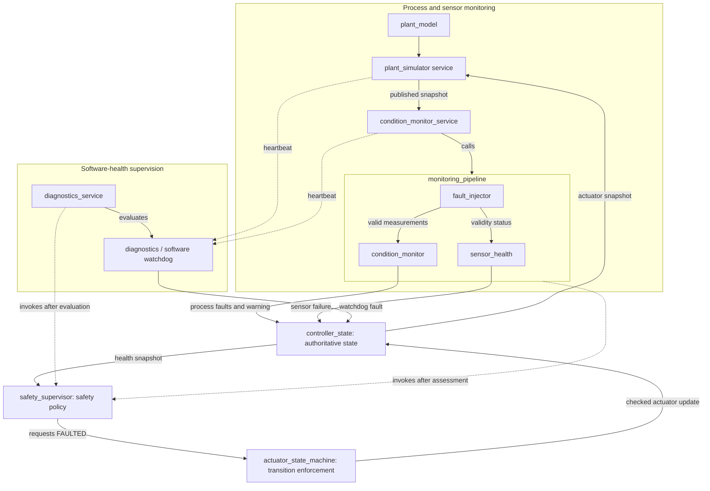
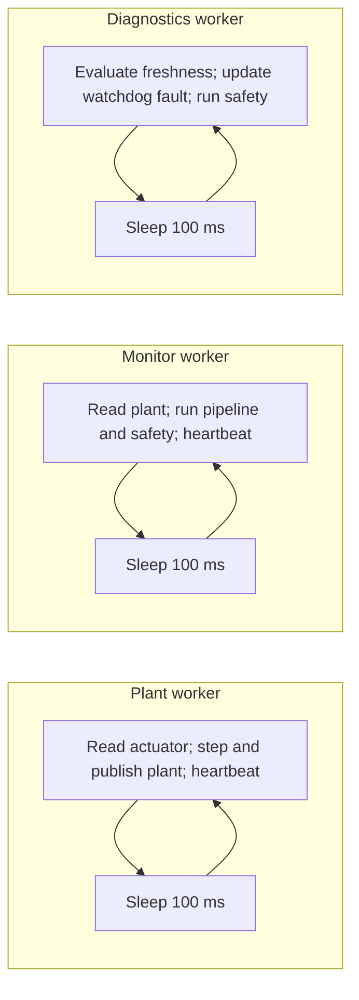
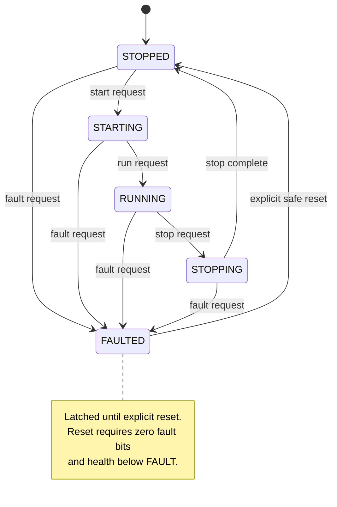
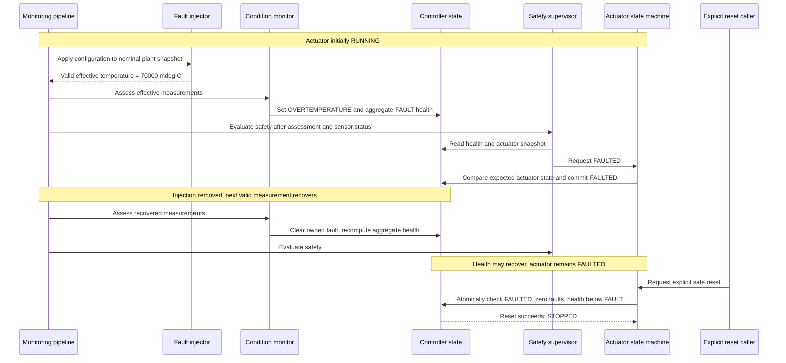

# Architecture

## System overview

This is a simulation-only industrial condition-monitoring controller implemented
in C on Zephyr RTOS 4.4.0, targeting `native_sim`. A deterministic motor/pump model
produces temperature, vibration, and current measurements. Fault injection,
condition monitoring, sensor-health handling, software-watchdog diagnostics,
and safety supervision drive an actuator state machine. Separate test and
telemetry applications exercise the same production modules with logical time.

## Overall architecture

The pipeline invokes the injector internally. Injection overlays a copy of the
nominal snapshot; it does not alter plant physics. Invalid samples skip condition
classification and retain the previous process fault/warning assessment, while
sensor-health handling asserts `SENSOR_FAILURE`. The supervisor then evaluates
the resulting controller health.

## Module responsibilities

| Module | Responsibility | Logic type |
|---|---|---|
| `controller_state` | Own state, snapshots, aggregate health, and atomic actuator updates | Synchronized state management |
| `plant_model` | Advance nominal measurements in fixed 100 ms steps | Deterministic |
| `plant_simulator` | Step the model and publish coherent snapshots | Runtime service |
| `fault_injector` | Apply configured abnormalities and explicit validity metadata | Deterministic transform; synchronized configuration |
| `condition_monitor` | Classify measurements and publish process assessment | Deterministic decision and state update |
| `sensor_health` | Update the sensor-failure contribution | Deterministic state update |
| `monitoring_pipeline` | Orchestrate injection, assessment, validity, and safety | Deterministic orchestration |
| `condition_monitor_service` | Read plant snapshots, run pipeline, report heartbeat | Runtime service |
| `diagnostics` | Track heartbeats, detect staleness, publish watchdog state | Deterministic decisions; synchronized state and runtime clock access |
| `diagnostics_service` | Evaluate diagnostics and invoke safety policy | Runtime service |
| `safety_supervisor` | Request FAULTED for FAULT or EMERGENCY_STOP health | Deterministic policy |
| `actuator_state_machine` | Validate transitions and request guarded reset | Deterministic policy; atomic commit through controller API |

## RTOS execution model

| Worker | Sleep interval | Zephyr priority | Stack |
|---|---:|---:|---:|
| Plant simulator | 100 ms | 5 | 1024 bytes |
| Condition monitor | 100 ms | 4 | 1024 bytes |
| Diagnostics | 100 ms | 3 | 1024 bytes |

The workers run independently; lower numeric priorities mean higher preemptive
priority in this configuration. Each supervised worker reports a heartbeat after
successful completion of its cycle. A heartbeat age **greater than 500 ms** is
stale; exactly 500 ms remains healthy. Initialization time supplies the grace
period before the first heartbeat. Diagnostics is not itself heartbeat-supervised.

`main` initializes controller, injector, and diagnostics before releasing worker
startup semaphores. Controller state, published plant snapshots, injection
configuration, and diagnostics state use mutexes. The plant worker owns the model
after initialization. Runtime diagnostics samples uptime under its mutex before
evaluating freshness. Its lock order is diagnostics mutex then controller mutex;
there is no reverse acquisition path.

These loops sleep after doing work, so actual cycle intervals include execution
and scheduling time. They do not demonstrate hard real-time deadline guarantees.

## Fault ownership

| Owner | Controller fault bits |
|---|---|
| Condition monitoring | `OVERTEMPERATURE`, `EXCESSIVE_VIBRATION`, `OVERCURRENT` |
| Sensor health | `SENSOR_FAILURE` |
| Diagnostics | `SOFTWARE_WATCHDOG` |

All names above use the `CONTROLLER_FAULT_` prefix. Runtime owners replace only
their own bits through the controller's aggregate-update APIs. Any remaining
fault bit keeps aggregate health at least FAULT. With no faults, the retained process
warning determines WARNING versus HEALTHY. EMERGENCY_STOP is preserved until
explicitly changed by its caller. Thus one subsystem's recovery cannot hide
another subsystem's fault.

## Safety state machine

Invalid transitions are rejected, including ordinary requests to leave FAULTED.
The supervisor requests FAULTED through the state machine when health is FAULT
or EMERGENCY_STOP, including while STOPPED. Recovered health does not restart
an actuator. Reset permits HEALTHY or WARNING health only when no fault bits
remain; it returns the actuator to STOPPED.

Transition legality remains in `actuator_state_machine`. After checking a
snapshot, it calls `controller_state_compare_exchange_actuator(expected, desired)`:
the expected-state comparison and write share one mutex acquisition, preventing
an intervening actuator change from being overwritten. Reset delegates to
`controller_state_try_reset_actuator()`, which checks actuator state, health, and
faults and performs the STOPPED write under that same controller mutex. Neither
operation exposes the mutex or private writable state to the state machine.

## Fault and recovery flow

The example assumes no other faults remain. The same ownership and latching
principle applies to sensor recovery and fresh-heartbeat recovery. The nominal
plant approaches 45°C while running; the 70°C example comes from injection,
not spontaneous overheating in the current plant model.

## Determinism and testability

The plant advances through explicit fixed steps. Injection is repeatable for a
given snapshot and configuration. Temperature classification uses signed values;
vibration and current comparisons preserve their full unsigned measurement
domain. Watchdog decisions accept supplied timestamps, and scenario applications
call production logic directly without runtime workers or timing sleeps.

Controller snapshot timestamps use Zephyr uptime; replay comparisons instead use
controlled plant and diagnostic timestamps. Plant determinism tests compare
semantic fields rather than structure padding. The telemetry application also
uses production C modules, then emits CSV for a Python-standard-library offline
HTML/SVG renderer; Python does not reproduce controller logic.

The verified baseline after correctness cleanup is **115 tests passed, 0 failed,
0 skipped**: controller state 13, plant model 8, monitoring/safety 47, Batch 2
injection/diagnostics/integration 39, and end-to-end scenarios 8.

## Scope and limitations

- Simulation only: `native_sim`, with no physical plant or hardware integration.
- Software heartbeat watchdog, not a hardware watchdog; it cannot act if the
  scheduler or its own worker stops executing.
- Not safety-certified. Thresholds are project simulation parameters, not
  universal industrial limits.
- Sleep-based workers and host execution do not establish hard real-time bounds.
